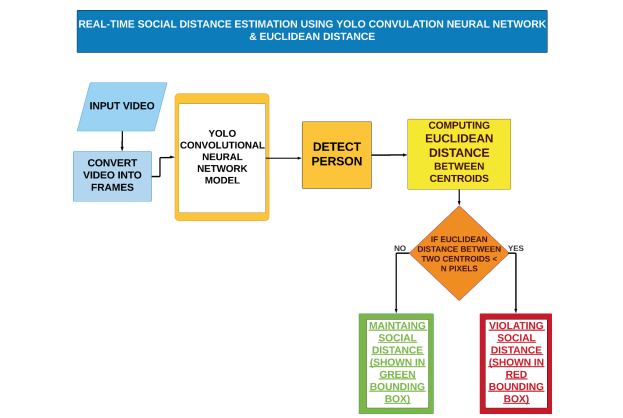
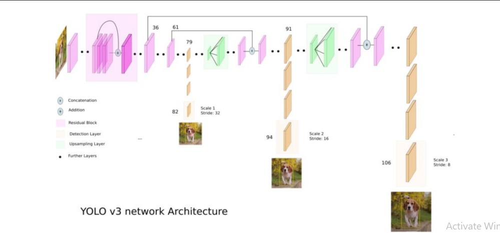
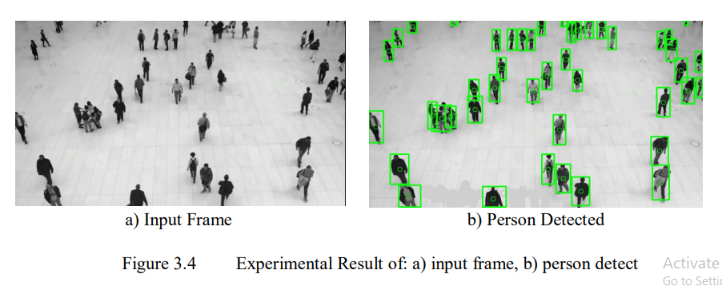
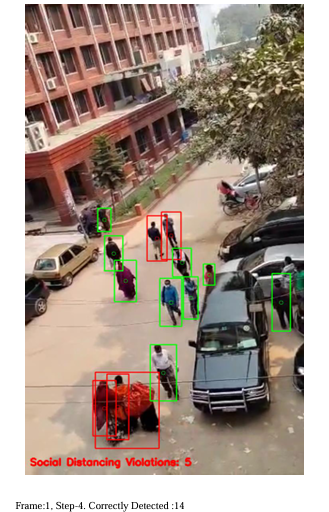
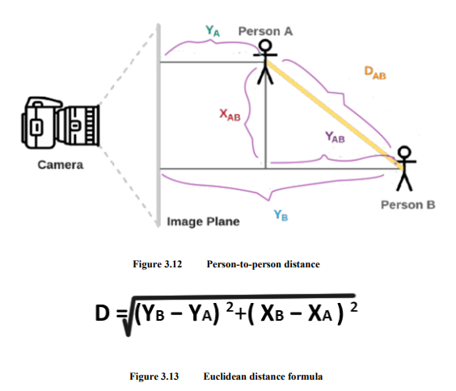
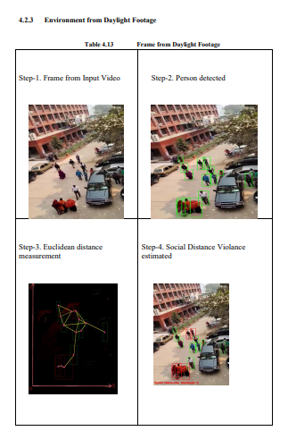
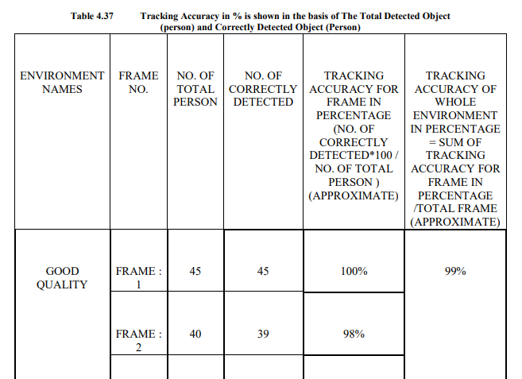
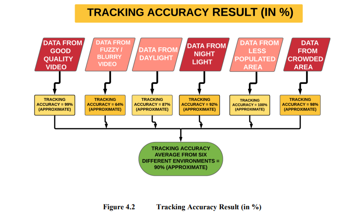

# Real-Time Social Distance Estimation Using YOLO CNN and Euclidean Distance.
The work was carried out as an **undergraduate thesis** for the degree of **B.Sc. in Computer Science and Engineering** at the **International Islamic University Chittagong (IIUC)**.

---

## Abstract 🧠

Social distancing became a significant research focus with the rise of COVID-19. Maintaining physical distance is one of the most effective ways to reduce virus transmission. This project proposes a method for estimating social distance using the latest CNN-based object detection model **YOLO** combined with **Euclidean distance**.

The system works on **top-down real-time videos**, detects people, and estimates distances between them. Compared to previously used CNN algorithms, the proposed method is easier to understand and ensures better speed and accuracy. Experiments conducted on datasets collected from **six different environments** achieved an **average tracking accuracy of approximately 90%**, demonstrating strong performance in real-time object detection and distance estimation.

---

## Objectives 🎯

* To estimate social distance in **real-time** from video footage
* To detect people using a CNN-based object detection model
* To calculate distances between individuals using **Euclidean distance**
* To evaluate tracking accuracy across **six different environments**

---

## Methodology ⚙️
<p align="center">
  
</p>

1. **Input Video**: Videos are collected from six different environments.
2. **Frame Extraction**: Videos are converted into frames using OpenCV.
3. **Person Detection**: YOLOv3 (pre-trained on the COCO dataset) detects only the *person* class.
4. **Centroid Tracking**: Bounding box centroids are tracked across frames.
5. **Distance Measurement**: Euclidean distance is computed between centroids.
6. **Violation Detection**:

   * Distance < 50 pixels → ❌ Red bounding box (violation)
   * Distance ≥ 50 pixels → ✅ Green bounding box (safe)
<p align="center">
  
</p>
<p align="center">
  
</p>
<p align="center">
  
</p>
<p align="center">
  
</p>
<p align="center">
  
</p>
---

## Tools & Technologies 🛠️

### Software & Platforms

* Python 3.8
* Visual Studio Code
* Google Colaboratory

### Libraries

* OpenCV Python 4.2.0.34
* NumPy 1.18.5
* Imutils 0.5.3
* Matplotlib
* Argparse
* SciPy 1.4.1

## Experimental Setup & Results 📊

The system was tested on **top-down video footage** collected from six different environments:

1. Good Quality Footage
2. Fuzzy Footage
3. Daylight Footage
4. Nightlight Footage
5. Less Populated Footage
6. Crowded Footage

Tracking accuracy was calculated using:

```text
Tracking Accuracy (%) = (Correctly Detected Persons × 100) / Total Persons
```

### Results Summary
<p align="center">
  
</p>

<p align="center">
  
</p>

---

## Conclusion 🏁

The proposed system demonstrates strong performance in real-time social distance estimation using YOLO and Euclidean distance. With an average tracking accuracy of approximately 90%, the model proves effective for monitoring social distancing from top-down CCTV footage.

---

## Future Work 🔮

* Extend the system to handle **side-view camera footage**
* Apply newer versions of object detection models
* Improve robustness under low-quality video conditions
